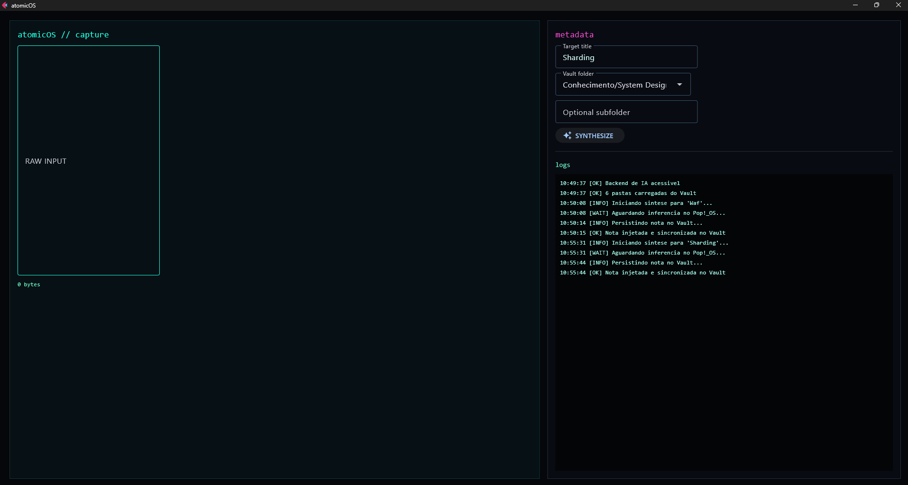

# atomicOS

atomicOS é um assistente desktop local para transformar anotações soltas em notas Markdown limpas, atômicas e organizadas dentro de um Vault do Obsidian.

Ele roda como um app Python/Flet, envia solicitações de síntese para um servidor Ollama local ou acessível pela rede local, e salva o Markdown final por meio da CLI do Obsidian. A ideia central é simples: manter o fluxo de escrita rápido, estruturado e privado usando uma IA local em vez de depender de uma API de LLM hospedada na nuvem.

## Preview da Interface



## Por Que atomicOS

- Fluxo com IA local-first: usa Ollama, então as notas podem ser sintetizadas por um modelo rodando na sua própria máquina ou na sua rede local.
- Saída nativa para Obsidian: cria ou complementa arquivos `.md` comuns diretamente no seu Vault.
- Persistência inteligente: pesquisa o Vault antes de gravar, faz append quando a nota alvo já existe e grava metadados via propriedades do Obsidian.
- Estrutura de nota atômica: transforma entradas bagunçadas em notas focadas com título, resumo, pontos-chave e exemplos práticos quando útil.
- Interface desktop: oferece uma UI simples em Flet para selecionar pastas do Vault, inserir anotações e criar notas sem sair do app.
- Configuração flexível: aceita variáveis de ambiente ou um arquivo local `atomicos.toml`.
- Persistência mais segura: valida caminhos, evita traversal inseguro e grava usando a CLI do Obsidian.

## Como Funciona

1. Você cola anotações soltas no atomicOS.
2. O atomicOS envia o texto para o Ollama usando o modelo local configurado.
3. O Ollama retorna uma nota Markdown sintetizada.
4. O atomicOS pesquisa a pasta alvo do Vault usando a CLI do Obsidian.
5. Se a nota alvo já existir, o conteúdo sintetizado é anexado com `append`.
6. Se a nota alvo ainda não existir, o arquivo Markdown é criado com `create`.
7. O atomicOS grava propriedades como `source`, `area`, `status`, `last_action` e `updated_at` com `property:set`.
8. A nota aparece no Obsidian como um arquivo Markdown normal.

## Arquitetura

```text
Interface desktop Flet
    -> Workflow de notas
        -> Inferência local com Ollama
        -> Limpeza do Markdown
        -> Persistência via CLI do Obsidian
            -> search
            -> create ou append
            -> property:set
            -> Vault do Obsidian
```

## Requisitos

- Python 3.11+
- Runtime desktop no Windows
- Ollama rodando localmente ou na rede local
- Um modelo instalado no Ollama, padrão: `qwen2.5:3b`
- CLI do Obsidian disponível como `obsidian`, ou configurada com `ATOMICOS_OBSIDIAN_EXECUTABLE`
- Um Vault do Obsidian já existente

## Instalação

Crie um ambiente virtual e instale o projeto:

```powershell
python -m venv .venv
.\.venv\Scripts\Activate.ps1
pip install -e .
```

Para desenvolvimento e testes:

```powershell
pip install -e .[dev]
```

## Configuração

O atomicOS pode ser configurado com variáveis de ambiente ou com um arquivo `atomicos.toml` na raiz do repositório.

### Variáveis de Ambiente

- `ATOMICOS_VAULT_ROOT`: caminho absoluto para o Vault do Obsidian
- `ATOMICOS_OBSIDIAN_EXECUTABLE`: executável da CLI do Obsidian, padrão: `obsidian`
- `ATOMICOS_OLLAMA_BASE_URL`: URL base do Ollama, padrão: `http://localhost:11434`
- `ATOMICOS_OLLAMA_MODEL`: nome do modelo no Ollama, padrão: `qwen2.5:3b`
- `ATOMICOS_OLLAMA_TIMEOUT`: timeout da requisição em segundos, padrão: `120`
- `ATOMICOS_OLLAMA_TEMPERATURE`: temperatura da geração, padrão: `0.1`
- `ATOMICOS_OLLAMA_NUM_CTX`: janela de contexto, padrão: `4096`

### Exemplo de `atomicos.toml`

```toml
[app]
vault_root = "C:/Users/voce/Documents/ObsidianVault"
obsidian_executable = "obsidian"

[ollama]
base_url = "http://localhost:11434"
model = "qwen2.5:3b"
timeout_seconds = 120
temperature = 0.1
num_ctx = 4096
```

Para um servidor Ollama rodando em outra máquina da rede local, altere `base_url` para o endereço dessa máquina:

```toml
[ollama]
base_url = "http://192.168.1.50:11434"
```

## Execução

```powershell
atomicos
```

Ou execute o módulo diretamente:

```powershell
python -m atomicos.main
```

## Configuração da IA Local

Instale e execute o Ollama, depois baixe o modelo padrão:

```powershell
ollama pull qwen2.5:3b
```

Se o Ollama estiver rodando na mesma máquina, a URL padrão já é suficiente:

```text
http://localhost:11434
```

Se o Ollama estiver rodando em outra máquina, confirme que o servidor está acessível a partir deste desktop e atualize `ATOMICOS_OLLAMA_BASE_URL` ou `atomicos.toml`.

## CLI do Obsidian

O atomicOS espera que a CLI do Obsidian suporte estes comandos:

```powershell
obsidian search query="termo" path="Pasta" limit=10 format=json
obsidian create path="Pasta/Nota.md" content="# Nota"
obsidian append path="Pasta/Nota.md" content="Complemento"
obsidian property:set path="Pasta/Nota.md" name="source" value="atomicOS" type=text
```

Se o executável tiver outro nome ou caminho, configure:

```powershell
$env:ATOMICOS_OBSIDIAN_EXECUTABLE = "C:\caminho\para\obsidian.exe"
```

## Smoke Test Sem Dependências Reais

O smoke test em modo dry-run valida as transições de estado do workflow sem exigir um Vault real, servidor Ollama ou CLI do Obsidian.

```powershell
python scripts\smoke_dry_run.py
```

A saída esperada inclui `[INFO]`, `[WAIT]`, `[OK]`, `success=True` e `clear_editor=True`.

## Testes

```powershell
python -m pytest
```

## Status do Projeto

atomicOS é um protótipo local-first em estágio inicial, focado em um fluxo específico: sintetizar anotações soltas com um modelo local de IA e persistir o resultado no Obsidian. A implementação atual é intencionalmente pequena e pragmática, com testes cobrindo configuração, tratamento de respostas do Ollama, segurança de caminhos no Vault, persistência inteligente com `search`/`append`/`property:set` e comportamento do workflow.
